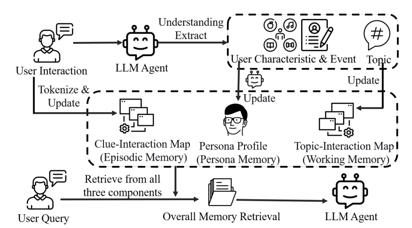
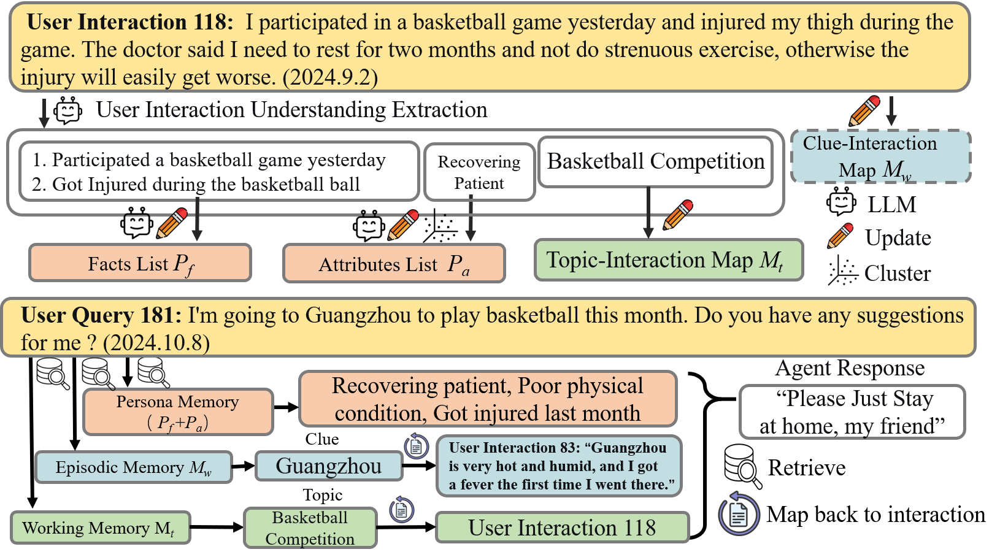

# O-Mem: Omni Memory System for Personalized, Long Horizon, Self-Evolving Agents


<!-- [](https://youtu.be/...) -->


<div align="center">
    
</div>

📌 Current agent memory systems often rely on **semantic clustering and chunk-based retrieval**, which can:

- ❌ Miss contextually important but semantically distant information (e.g., health status affecting weekend plans)
- ❌ Introduce retrieval noise due to suboptimal grouping- ❌ Fail to capture evolving user characteristics over time**o-mem** addresses these issues by rethinking memory as an **active user modeling process**, not just passive storage. Inspired by personal informatics theory, o-mem continuously extracts and updates:
- 🔹 **User Persona Attributes** (e.g., preferences, habits, life stage)
- 🔹 **Event Records** (e.g., recent job change, travel plans)
- 🔹 **Topic-Indexed Messages** (for contextual grounding)

This enables **hierarchical, user-aware retrieval**: agents first reason about *who the user is*, then retrieve *what they said* — leading to more coherent, adaptive, and personalized responses.


## 🚀 Key Features✅ **Dynamic User Profiling**> Automatically extract and update user attributes from ongoing interactions — no manual annotation needed.

✅ **Hierarchical Memory Structure**> Three-tier design:> - **Persona Layer**: Stable & evolving user traits> - **Event Layer**: Significant life/contextual events> - **Message Layer**: Topic-indexed raw dialog history✅ **User-Centric Retrieval**> Retrieve based on *user state* first, then *topic relevance* — reducing noise and improving coherence.

✅ **Interaction-Time Scaling**> Memory grows and adapts with each interaction — enabling true long-term personalization.

✅ **Evaluation Suite Included**> Benchmark scripts for:> - Persona-based QA (LoCoMo)> - Response selection (PERSONAMEM)> - In-depth report generation (Personalized Deep Research Bench)

✅ **Extensible & Modular**> Plug into any LLM agent pipeline via clean APIs. Easy to customize extraction rules or add new memory types.

## 🧩 Architecture

[Raw Interaction] ↓[Memory Writer] → [Extract: Attributes + Events]
↓[Update: Dynamic User Profile]
↓[Hierarchical Indexing]
↓[Retriever] ← [Query: "What would this user care about?"]
↓[Context-Aware Prompting] → [LLM Agent]

## 🔄O-Mem Workflow Visualization

<div align="center">
    
</div>

## 🧩Project Structure

```
memory_chain/
├── __init__.py           # Package exports
├── memory.py             # MemoryChain - main memory container
├── memory_manager.py     # MemoryManager - high-level API
├── working_memory.py     # Working Memory implementation
├── episodic_memory.py    # Episodic Memory implementation
├── persona_memory.py     # Persona Memory (active user profiling)
├── prompts.py            # LLM prompt templates
└── utils.py              # Utility functions

example_usage.py          # Usage examples
config.yaml.example       # Configuration template
requirements.txt          # Dependencies
```

## 🧠Memory Types

### Working Memory
- **Purpose**: Short-term storage for recent conversation
- **Capacity**: Fixed size queue (default: 20 messages)
- **Behavior**: Oldest messages overflow to Episodic Memory

### Episodic Memory
- **Purpose**: Long-term storage for events and topics
- **Features**: 
  - Topic clustering via semantic similarity
  - Event-level and topic-level memories
  - Attribute and fact extraction

### Persona Memory
- **Purpose**: Active user profiling and preferences
- **Contents**:
  - Preferences (likes, dislikes, interests)
  - Attributes (personality traits, facts)
  - Dynamically updated user characteristics

## ⚙️Installation

```bash

# Install dependencies
pip install -r requirements.txt

# Copy and configure settings
cp config.yaml.example config.yaml
# Edit config.yaml with your OpenAI API key
```

## 🚀Quick Start


```bash
# Run full example
python example_usage.py

# Run simplified example
python example_usage.py simple

#Run test experiments for locomo benchmark with different arguments
python locomo_experiment_retrieval_optimize_ablation_study.py
```

## ⚙️Configuration

Create a `config.yaml` file:

```yaml
model:
  llm_model: "model name"
  openai_api_key: "your-openai-api-key"
  openai_base_url: "https://api.openai.com/v1"
```

## 🧩 Community Support Note

We note that the performance of GPT-4.1 has recently degraded in preliminary observations, and the model is expected to be deprecated in the near future. Due to these changes, results obtained using GPT-4.1 may not be fully reproducible over time. For research purposes, especially for individuals or institutions with limited access to large language models, we are willing to share the original model outputs (e.g., inference logs, generated responses) upon request. We encourage careful interpretation of the experimental results in light of the evolving nature of commercial LLMs, and refer readers to the discussion in our technical report for guidance on result analysis and limitations.


